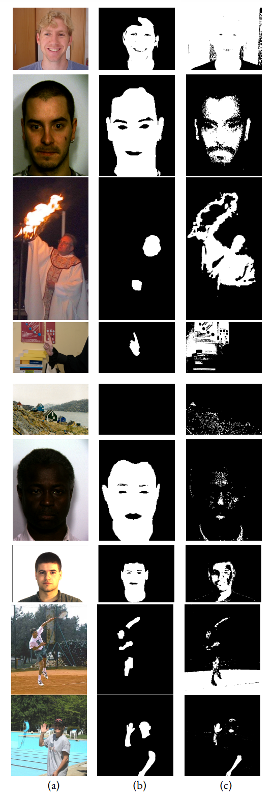
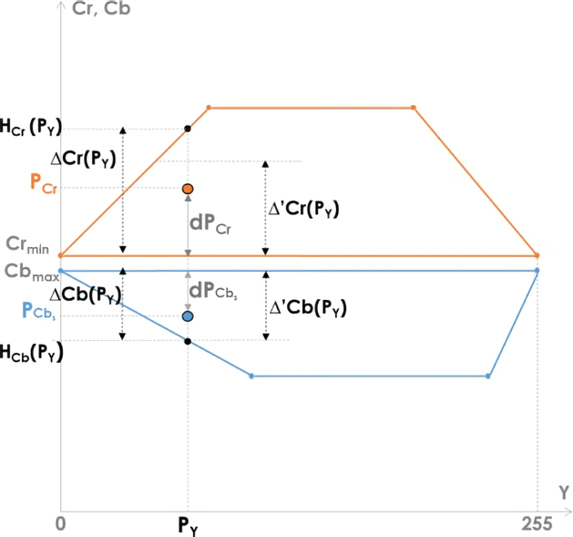

[ecu]: https://documents.uow.edu.au/~phung/download.html "ECU download page"
[hgr]: http://sun.aei.polsl.pl/~mkawulok/gestures/ "HGR download page"
[schmugge]: https://www.researchgate.net/publication/257620282_skin_image_Data_set_with_ground_truth "Schmugge download page"
[pratheepan]: http://cs-chan.com/downloads_skin_dataset.html "Pratheepan download page"
[abd]: https://github.com/MRE-Lab-UMD/abd-skin-segmentation "abd-skin download page"
[vpu]: http://www-vpu.eps.uam.es/publications/SkinDetDM/#dataset "VPU download page"
[uchile]: http://web.archive.org/web/20070707151628/http://agami.die.uchile.cl/skindiff/ "UChile download page"

[thesis]: https://github.com/123mpozzi/skin-detection-thesis "Human Skin Detection In Color Images"
# Adaptive rule based skin detector
Detecting human skin using thresholds.  
This work is part of my [Bachelor thesis][thesis].

#### Original Paper
N. Brancati, G. De Pietro,M. Frucci, and L. Gallo. “Human skin detection through correlation rules between the YCb and YCr subspaces based on dynamic color clustering”. Computer Vision and Image Understanding 155, 2017, pp. 33–42.
https://doi.org/10.1016/j.cviu.2016.12.001

#### Credits
Credits to the authors of the original version: 
https://github.com/nadiabrancati/skin_detection/


## Outcomes

<div align="center">
    
    <br>
    Significant outcomes: (a) the input image; (b) the ground truth; (c) detected skin pixels.
    <br>Input images are from ECU, HGR, and Schmugge datasets.
</div>
<br>

These are some significant outcomes (hence not representative; for the skin detector performance see [Performance](#Performance))
that shows the strengths and limitations of the skin detector.  
Skin Detection is a challenging task because of materials with skin-like colors (wood, copper, leather, clay),
conditions that modify an image appearance (lighting, camera color science, motion blur),
and the wide range of skin tones that the human skin may assume.  

The first, third, and the last three rows represent some of the challenges described.  
The detector follows rules to dynamically generate the skin cluster range, but it has no capability of seeing feature patterns in images, hence it can misclassify images with no skin pixels if there are pixels with skin-like color, such as in the fifth row.

An in-depth analysis of outcomes can be seen in the thesis.


<a name="Performance"></a>
## Performance

The metrics are calculated as follows.  
Initially, the metrics are measured for all the instances, then the average and population standard
deviation for each metric are computed.

Again, an in-depth analysis of performance can be seen in the thesis.

#### Validation
Before the evaluation process on the chosen datasets, the skin detector has been validated on the datasets splits used in its original paper. In this way, it has been possible to check their proper functioning.  
The original paper uses a metrics averaging of this type: the Recall, Precision, and Specificity measures are calculated as average scores over the set of instances, then the obtained scores are used to calculate F<sub>1</sub>-Score and D<sub>prs</sub>.

| | HGR<sup>1</sup> F<sub>1</sub> | ECU F<sub>1</sub> | Pratheepan F<sub>1</sub> | HGR<sup>1</sup> D<sub>prs</sub> | ECU D<sub>prs</sub> | Pratheepan D<sub>prs</sub> |
| ---:            | :---: | :---: | :---: | :---: | :---: | :---: |
| Original        | 0.8252 | 0.6550 | 0.6592 | 0.2667 | 0.5043 | 0.5149 |
| Implementation  | 0.8257 | 0.6586 | 0.6630 | 0.2660 | 0.5006 | 0.5096 |
| | | | | | | |
| Change          | 0.0005 | 0.0036 | 0.0038 | 0.0007 | 0.0037 | 0.0053 |
> Each dataset was used in its entirety to perform the testing.  
<sup>1</sup>HGR consists of: HGR1, HGR2A-downscaled, HGR2B-downscaled.


#### Performance on single databases
For each dataset: predictions are performed on the test set.  

|             | ECU | HGR | Schmugge |
| ---:            | :---:              | :---:  | :---: |
| F<sub>1</sub> ↑       | 0.6356 ± 0.24 | 0.7362 ± 0.27 | 0.4280 ± 0.34 |
| IoU ↑                 | 0.5088 ± 0.25 | 0.6467 ± 0.30 | 0.3323 ± 0.28 |
| D<sub>prs</sub> ↓     | 0.5340 ± 0.32 | 0.3936 ± 0.36 | 0.8148 ± 0.48 |


#### Performance on single skin tones
The methodology is the same as of 'Performance on single databases', but skin tones datasets are involved instead.

|             | DARK | MEDIUM | LIGHT
| ---:            | :---:              | :---:  | :---: |
| F<sub>1</sub> ↑       | 0.2620 ± 0.14 | 0.6316 ± 0.20 | 0.6705 ± 0.14 |
| IoU ↑                 | 0.1587 ± 0.10 | 0.4889 ± 0.19 | 0.5190 ± 0.14 |
| D<sub>prs</sub> ↓     | 0.8548 ± 0.12 | 0.5155 ± 0.24 | 0.4787 ± 0.17 |

#### Inference time

Measured inference time: `0.007717 ± 0.000` seconds.  
Methodology is explained in the thesis.


## Skin detection algorithm

Algorithm overview  
1. Input image RGB to YCbCr
2. Cr<sub>max</sub> and Cb<sub>min</sub> computation
3. Pixel-wise computation of the correlation rules parameters
4. Pixel-wise correlation rules check

The skin pixels clusters assume a trapezoidal shape in the YCb and YCr color subspaces.  Moreover, the shape and size of the trapezium vary according to many factors, such as the illumination conditions.
In high illumination conditions, the base of the trapezium results larger.  

Besides, the chrominance components of a skin pixel P with coordinates (P<sub>Y</sub>, P<sub>Cb</sub>, P<sub>Cr</sub>) in the YCbCr space exhibit the following behavior: the further is the (P<sub>Y</sub>, P<sub>Cr</sub>) point from the longer base of the trapezium in the YCr subspace, the further is the (P<sub>Y</sub>, P<sub>Cb</sub>) point from the longer base of the trapezium in the YCb subspace, and vice versa.

The aforementioned observations are the base of the method: it tries to define image-specific trapeziums in the YCb and YCr color subspaces and then verifies that the correlation rules between the two subspaces reflect the inversely proportional behavior of the chrominance components.

<br/>
<div align="center">
  
  <br>
  Computation of the correlation rules parameters. Adapted from the original paper (Brancati et al. 2017)
</div>
<br>


## Usage

#### Setup

Install pip requirements (not required for single image skin detection)  
```bash
pip install -r requirements.txt
```

Build the container  
```bash
docker-compose up -d opencv
```

Build the executable application  
```bash
docker-compose exec opencv ./build.sh app
```

Datasets: place downloaded datasets inside the `dataset` folder in the project root directory (eg. dataset/Schmugge).  
>More information on this process can be read in the next section

Datasets splits: pre-defined dataset splits featured in the thesis are provided into the `dataset` folder; to use a pre-defined file, unzip it to its dataset's directory (eg. place `HGR_data.csv` into `dataset/HGR_small`).  


Once added, datasets need processing to create a CSV file representing their images, masks, and splits:  
```bash
python main.py reset -d <db-name>
```

#### Skin Detection


Note: to perform skin detection commands via the python wrapper, sudo is needed, so perform a 
`sudo echo` and enter password before issuing the commands.

On an image which has no groundtruth  
```bash
docker-compose exec opencv ./app imagein.jpg imageout.png

# alternative
python main.py image -p <path-to-image-to-predict> | sudo docker-compose exec -T opencv bash
```

Over a dataset  
```bash
python main.py single -t <db-target> | sudo docker-compose exec -T opencv bash

# eg. Skin detection on ECU test set:  
python main.py single -t ECU | sudo docker-compose exec -T opencv bash
```
In batch mode on target datasets  
```bash
# Target an arbitrary number of datasets with -t <db-name>
python main.py batch -t <db1> -t <db2> -t <db3> | sudo docker-compose exec -T opencv bash
```


#### Measure inference time  
```bash
python main.py bench | sudo docker-compose exec -T opencv bash
```

#### Measure metrics  
```bash
python main.py eval -p <path-to-predictions-dir>  

# eg. measure metrics of the predicted images of dataset 'ecu':  
python main.py eval -p predictions\ecu  
```

#### See commands usage
```bash
python main.py --help  
python main.py batch --help  
```


## Public datasets supported

To import a dataset, place it into the `dataset` folder and rename its root directory to match its name from the list above. For HGR, the downscaled versions of HGR2A and HGR2B are used, so it is referred to as HGR_small in the program, and so must be its folder.


| Name            |  Description                                               | Download |
| ---:            | :---:                                                      | :---: |
| ECU [1]         | 3998 pictures, mostly face and half-body shots             | [Download (ask the authors)][ecu] |
| HGR [2]         | 1558 hand gesture images                                   | [Download][hgr] |
| Schmugge [3]    | 845 images, mostly face shots                              | [Download][schmugge] |
| Pratheepan [4]  | 78 pictures randomly sampled from the web                  | [Download][pratheepan] |
| abd [5]         | 1400 abdominal pictures                                    | [Download][abd] |
| VPU [6]         | 285 human activity recognition images                      | [Download][vpu] |
| UChile [7]      | 101 images obtained from the web and digitized news videos | [Download][uchile] |


| Ref   | Publication |
| :---  | :--- |
| 1     | Phung, S., Bouzerdoum, A., & Chai, D. (2005). Skin segmentation using color pixel classification: analysis and comparison. IEEE Transactions on Pattern Analysis and Machine Intelligence, 27(1), 148-154. https://doi.org/10.1109/tpami.2005.17  |
| 2 | Kawulok, M., Kawulok, J., Nalepa, J., & Smolka, B. (2014). Self-adaptive algorithm for segmenting skin regions. EURASIP Journal on Advances in Signal Processing, 2014(1). https://doi.org/10.1186/1687-6180-2014-170 |
| 3 | Schmugge, S. J., Jayaram, S., Shin, M. C., & Tsap, L. V. (2007). Objective evaluation of approaches of skin detection using ROC analysis. Computer Vision and Image Understanding, 108(1-2), 41-51. https://doi.org/10.1016/j.cviu.2006.10.009 |
| 4 | Tan, W. R., Chan, C. S., Yogarajah, P., & Condell, J. (2012). A Fusion Approach for Efficient Human Skin Detection. IEEE Transactions on Industrial Informatics, 8(1), 138-147. https://doi.org/10.1109/tii.2011.2172451 |
| 5 | Topiwala, A., Al-Zogbi, L., Fleiter, T., & Krieger, A. (2019). Adaptation and Evaluation of Deep Learning Techniques for Skin Segmentation on Novel Abdominal Dataset. 2019 IEEE 19th International Conference on Bioinformatics and Bioengineering (BIBE). https://doi.org/10.1109/bibe.2019.00141 |
| 6 | SanMiguel, J. C., & Suja, S. (2013). Skin detection by dual maximization of detectors agreement for video monitoring. Pattern Recognition Letters, 34(16), 2102-2109. https://doi.org/10.1016/j.patrec.2013.07.016 |
| 7 | J. Ruiz-del-Solar and R. Verschae. “SKINDIFF-Robust and fast skin segmentation”. Department of Electrical Engineering, Universidad de Chile, 2006. |
